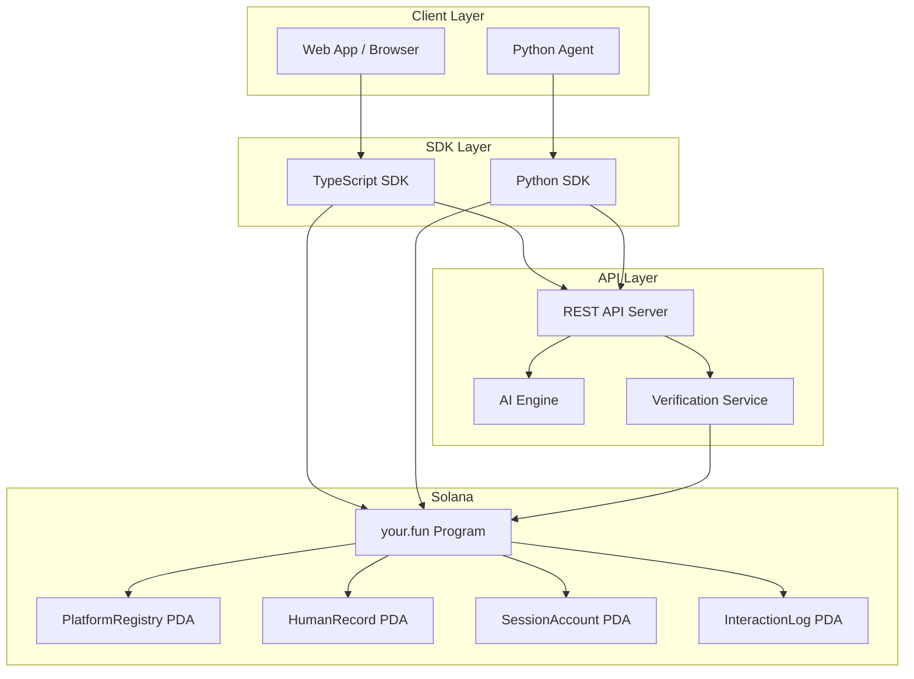
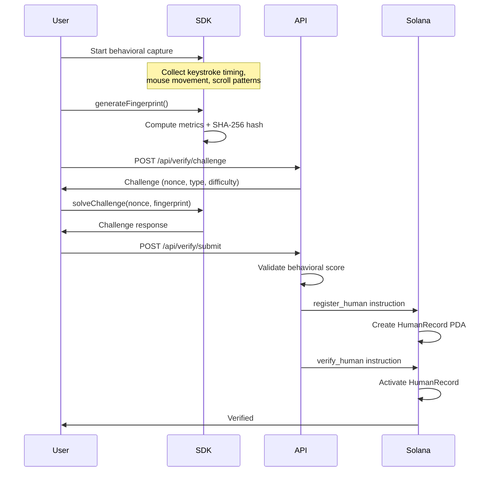

<p align="center">
  
</p>

<p align="center">
  <a href="https://your.fun/"></a>
  <a href="https://x.com/yourdotfun"></a>
  <a href="#"></a>
  <a href="#"></a>
  <a href="#"></a>
  <a href="#"></a>
  <a href="LICENSE"></a>
</p>

---

<h3 align="center"><b>The one&only fun place.</b></h3>

<p align="center">
  Proof-of-Human verification, AI-powered learning companions,<br />
  and a community built on Solana -- where humans come first.

  CA : Fpj1ifYu5YSnhfgLGE5bcnLGcKAJjQjMzt6QK83nbonk
</p>

---

# your.fun

your.fun is a Proof-of-Human community and learning interface built on Solana. It combines behavioral biometrics with AI companion agents to create a verified, human-only learning environment. Users prove their humanity through interaction patterns, then engage with personalized AI companions that adapt to their learning style.

The platform consists of:

- **On-chain Solana program** -- Proof-of-Human registration, verification, and session management
- **TypeScript SDK** -- Client library for browsers and Node.js
- **Python SDK** -- Async client optimized for AI agents and automation
- **REST API** -- Bridge between the AI engine and Solana verification

---

## Architecture



## Verification Flow

The Proof-of-Human process works in three stages:



---

## Installation

Clone the repository and set up each component:

```bash
git clone https://github.com/yourdotfun/your.fun.git
cd your.fun
```

### Solana Program (Rust)

Requires [Anchor CLI](https://www.anchor-lang.com/) and Rust toolchain:

```bash
cd programs/your-fun
cargo build
```

### TypeScript SDK

```bash
cd sdk/typescript
npm install
npm run build
```

### Python SDK

```bash
cd sdk-python
pip install -e .
```

### API Server

```bash
cd api
npm install
npm run dev
```

---

## Usage

### TypeScript -- Register and Verify

```typescript
import { Connection } from "@solana/web3.js";
import { YourFunClient, ProofGenerator } from "@yourfun/sdk";

const connection = new Connection("https://api.devnet.solana.com");
const client = new YourFunClient(connection, wallet);

// Collect behavioral data
const proof = new ProofGenerator();
proof.recordKeystroke(Date.now(), Date.now() + 85);
proof.recordMouseMovement(120, 340, Date.now());
// ... collect more events

// Generate fingerprint and solve challenge
const fingerprint = proof.generateFingerprint();
const nonce = proof.generateChallengeNonce();
const solution = proof.solveChallenge(nonce, fingerprint.hash);

// Register on-chain
await client.registerHuman({
  challengeNonce: nonce,
  fingerprintHash: fingerprint.hash,
});
```

### TypeScript -- AI Companion Session

```typescript
import { AICompanion, PersonalityType } from "@yourfun/sdk";

const companion = new AICompanion(
  "http://localhost:3100",
  authToken,
  PersonalityType.Mentor
);

await companion.startSession("Solana Fundamentals");

// Standard chat
const response = await companion.chat("What is a Program Derived Address?");
console.log(response.reply);
console.log("Score:", response.suggestedScore);

// Streaming chat
for await (const token of companion.chatStream("Explain the account model")) {
  process.stdout.write(token);
}
```

### Python -- Full Verification Flow

```python
import asyncio
from nacl.signing import SigningKey
from yourfun import YourFunClient, ProofGenerator, PersonalityType

async def main():
    keypair = SigningKey.generate()

    async with YourFunClient(keypair) as client:
        # Check verification status
        status = await client.get_verification_status()

        if not status.is_verified:
            # Request challenge
            challenge = await client.request_challenge("behavioral")

            # Generate proof
            proof = ProofGenerator()
            proof.record_keystroke(1000.0, 1085.0)
            proof.record_mouse_movement(120, 340, 1100.0)
            # ... collect more events

            fingerprint = proof.generate_fingerprint()
            solution = proof.solve_challenge(
                challenge.challenge_data.encode(),
                fingerprint.hash_bytes,
            )

            # Submit verification
            result = await client.submit_verification(
                challenge.challenge_id,
                {"responseTimeMs": 1500},
                {"events": proof.event_count},
            )

        # Start AI companion session
        session_id = await client.start_session(
            "Solana Fundamentals",
            PersonalityType.EXPLORER,
        )

        response = await client.chat("How does Solana achieve high throughput?")
        print(response.reply)

asyncio.run(main())
```

### Python -- Streaming Chat

```python
async with YourFunClient(keypair) as client:
    await client.start_session("Proof-of-Human Concepts")

    async for token in client.chat_stream("Explain behavioral biometrics"):
        print(token, end="", flush=True)
```

---

## Project Structure

```
your.fun/
|
|-- programs/your-fun/              Solana Anchor program (Rust)
|   |-- Cargo.toml
|   |-- src/
|       |-- lib.rs                  Program entrypoint
|       |-- state.rs                Account structures (PDA definitions)
|       |-- error.rs                Custom error codes
|       |-- instructions/
|           |-- mod.rs              Module exports
|           |-- initialize.rs       Platform registry setup
|           |-- register_human.rs   Human registration with fee transfer
|           |-- verify_human.rs     Challenge-response verification
|           |-- session.rs          Session lifecycle (create/close/extend)
|           |-- interaction.rs      Learning interaction recording
|
|-- sdk/typescript/                 TypeScript SDK
|   |-- package.json

|   |-- tsconfig.json
|   |-- src/
|       |-- index.ts                Barrel exports
|       |-- client.ts               YourFunClient (Solana interactions)
|       |-- ai.ts                   AICompanion (chat, streaming, quiz)
|       |-- proof.ts                ProofGenerator (behavioral fingerprint)
|       |-- pda.ts                  PDA derivation helpers
|       |-- types.ts                TypeScript interfaces
|
|-- sdk-python/                     Python SDK
|   |-- setup.py
|   |-- yourfun/
|       |-- __init__.py             Package exports
|       |-- client.py               Async HTTP client
|       |-- ai.py                   AI companion interface
|       |-- proof.py                Proof-of-Human generator
|       |-- solana.py               Transaction builder
|       |-- types.py                Data classes
|
|-- api/                            REST API server
|   |-- package.json
|   |-- tsconfig.json
|   |-- src/
|       |-- index.ts                Express server
|       |-- middleware/
|       |   |-- auth.ts             Wallet signature authentication
|       |-- routes/
|       |   |-- chat.ts             AI chat endpoints
|       |   |-- verify.ts           PoH verification endpoints
|       |   |-- learn.ts            Learning path endpoints
|       |-- services/
|           |-- ai-engine.ts        AI response generation
|           |-- solana.ts           Solana transaction service
|
|-- banner.jpg                      Repository banner
|-- LICENSE                         MIT License
|-- README.md                       This file
```

---

## On-Chain Account Model

The program uses four PDA-based account types:

| Account            | Seeds                                          | Purpose                        |
| ------------------- | ---------------------------------------------- | ------------------------------ |
| PlatformRegistry   | `["registry"]`                                 | Global config and statistics   |
| HumanRecord        | `["human", wallet]`                            | Per-user verification state    |
| SessionAccount     | `["session", human_record, session_index]`     | AI companion session           |
| InteractionLog     | `["interaction", session, interaction_index]`  | Individual learning record     |

### Scoring Algorithm

Interaction scores are computed using a weighted formula:

```
base_score = raw_score * type_multiplier / 100
duration_bonus = min(duration_seconds, 300) / 30
total = base_score + duration_bonus
```

Type multipliers:
- Chat: 1.0x
- Quiz: 2.0x
- Exercise: 3.0x
- Review: 1.5x

---

## API Endpoints

| Method   | Path                         | Auth     | Description                           |
| -------- | ---------------------------- | -------- | ------------------------------------- |
| GET      | `/health`                    | No       | Service health check                  |
| POST     | `/api/verify/challenge`      | No       | Generate PoH challenge                |
| POST     | `/api/verify/submit`         | No       | Submit challenge response             |
| GET      | `/api/verify/status/:wallet` | No       | Check verification status             |
| POST     | `/api/chat/session`          | Wallet   | Create companion session              |
| POST     | `/api/chat`                  | Wallet   | Send message (full response)          |
| POST     | `/api/chat/stream`           | Wallet   | Send message (SSE stream)             |
| DELETE   | `/api/chat/session/:id`      | Wallet   | Close companion session               |
| GET      | `/api/learn/topics`          | Wallet   | List learning topics                  |
| GET      | `/api/learn/topics/:id`      | Wallet   | Get topic details                     |
| GET      | `/api/learn/progress`        | Wallet   | Get learning progress                 |
| POST     | `/api/learn/complete`        | Wallet   | Mark lesson completed                 |
| POST     | `/api/learn/quiz/submit`     | Wallet   | Submit quiz answer                    |

Authentication uses wallet signatures in the format:

```
Authorization: Bearer <base58-wallet>.<base58-signature>.<unix-timestamp>
```

The signed message format is `your.fun-auth:<timestamp>`. Signatures are valid for 5 minutes.

---

## Companion Personalities

The AI companion supports five personality archetypes:

| ID | Name         | Style                                                    |
| -- | ------------ | -------------------------------------------------------- |
| 0  | Mentor       | Patient guidance, step-by-step explanations              |
| 1  | Explorer     | Curious discovery, cross-domain connections              |
| 2  | Challenger   | Rigorous analysis, devil's advocate                      |
| 3  | Collaborator | Paired thinking, shared problem-solving                  |
| 4  | Storyteller  | Narrative-driven teaching, vivid analogies               |

---

## Links

- Website: [https://your.fun/](https://your.fun/)
- Twitter: [https://x.com/yourdotfun](https://x.com/yourdotfun)

## License

MIT License. See [LICENSE](LICENSE) for details.
